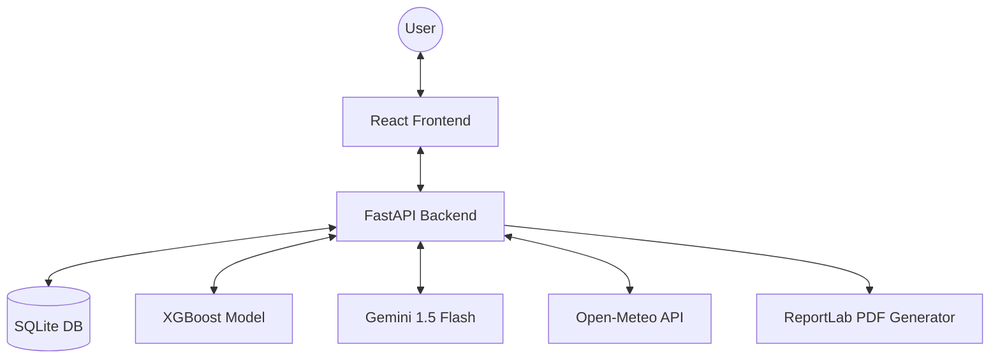

# AetherAI: Environmental Intelligence Platform 🌍💨

[](https://opensource.org/licenses/MIT)
[](https://fastapi.tiangolo.com/)
[](https://reactjs.org/)
[](https://xgboost.ai/)
[](https://deepmind.google/technologies/gemini/)

**AetherAI** is a next-generation environmental intelligence platform designed to bridge the gap between complex atmospheric data and actionable urban policy. By leveraging advanced machine learning, generative AI, and real-time environmental APIs, AetherAI provides city planners and citizens with the tools to predict, simulate, and mitigate air pollution.

---

## 🚀 Key Features

- **📊 Real-time AQI Monitoring**: Live tracking of European AQI, PM2.5, PM10, and NO2 across any global city using Open-Meteo APIs.
- **🔮 Neural AQI Forecasting**: 72-hour predictive modeling using **XGBoost** Regressors trained on synthetic and historical data.
- **🧠 Aether Neural Strategy Optimizer**: An AI-driven engine that recommends optimal policy interventions (traffic diversion, industrial throttling) based on current chemical signatures.
- **🧪 Simulation Lab**: A "What-If" sandbox for environmental policy. Adjust traffic, industry, and greenery sliders to see real-time impact on projected AQI.
- **💬 Aether AI Chat**: A dedicated environmental assistant powered by **Gemini 1.5 Flash**, providing localized health advice and scientific insights.
- **📄 Automated Intelligence Dossiers**: Generate professional PDF reports (using ReportLab) summarizing local environmental conditions and strategic roadmaps.
- **🔬 Chemical Signature Recognition**: AI-based source identification—detecting whether pollution is primarily from vehicular traffic, industrial emissions, or construction.

---

## 🛠️ Tech Stack

### **Frontend**
- **Core**: React 19, TypeScript, Vite
- **Styling**: Tailwind CSS, Radix UI
- **Animations**: Framer Motion, GSAP (ScrollTrigger)
- **Visualization**: Recharts (Custom Gradient Charts)
- **Icons**: Lucide React

### **Backend**
- **Framework**: FastAPI (Python 3.10+)
- **ORM**: SQLAlchemy (SQLite)
- **AI/LLM**: Google Generative AI (Gemini SDK)
- **Data Science**: Scikit-learn, Pandas, XGBoost
- **PDF Core**: ReportLab

### **ML Pipeline**
- **Model**: XGBoost Regressor
- **Features**: PM2.5, PM10, NO2, CO, Temperature, Humidity, Wind Speed, Temporal Dynamics (Day of Year/Week).
- **Automation**: Integrated data generator and automated training scripts.

---

## 🏗️ Architecture



---

## 🏁 Getting Started

### **Prerequisites**
- Node.js (v18+)
- Python (v3.10+)
- Gemini API Key (Optional, for Chat/Narratives)

### **Backend Setup**
1. Navigate to the `backend` directory.
2. Create a virtual environment:
   ```bash
   python -m venv venv
   source venv/bin/activate  # On Windows: venv\Scripts\activate
   ```
3. Install dependencies:
   ```bash
   pip install -r requirements.txt
   ```
4. Create a `.env` file based on `.env.example`:
   ```env
   GEMINI_API_KEY=your_api_key_here
   ```
5. Run the server:
   ```bash
   fastapi dev app/main.py
   ```

### **Frontend Setup**
1. Navigate to the `frontend` directory.
2. Install dependencies:
   ```bash
   npm install
   ```
3. Run the development server:
   ```bash
   npm run dev
   ```

### **ML Model Training**
If the model (`xgboost_aqi_model.pkl`) is missing:
1. Navigate to the `ml` directory.
2. Generate synthetic data: `python data_generator.py`
3. Train the model: `python train_model.py`

---

## 🗺️ Roadmap & Future Enhancements
- [ ] Multi-city comparative analytics.
- [ ] Satellite imagery integration for wildfire/smoke detection.
- [ ] Mobile app (React Native) for real-time citizen alerts.
- [ ] Blockchain-based environmental transparency ledger.

---

## ⚖️ License
Distributed under the MIT License. See `LICENSE` for more information.

## ✉️ Contact
**Vaibhav** - [GitHub](https://github.com/Vaibhav-1819)

Project Link: [https://github.com/Vaibhav-1819/AetherAI](https://github.com/Vaibhav-1819/AetherAI)
